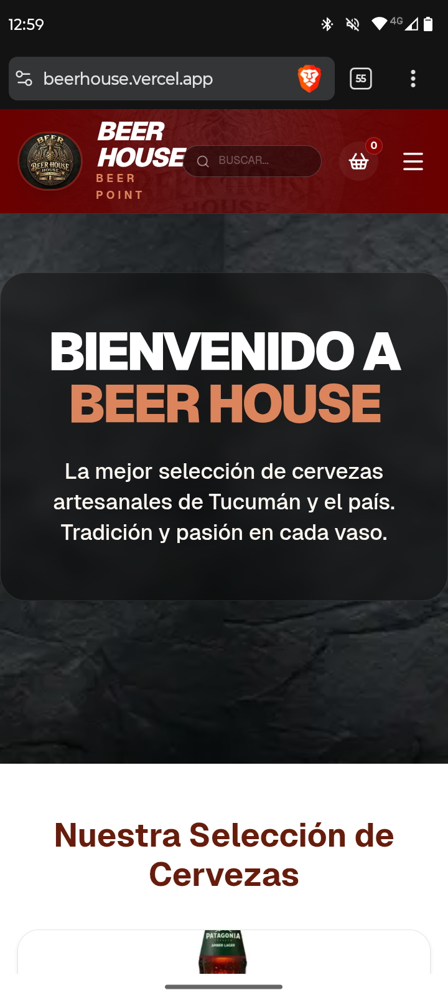

# 🍺 BeerHouse - Landing Page


Landing page moderna desarrollada para una cervecería/bar ficticio llamado **BeerHouse**.  
Diseñada para transmitir una experiencia visual atractiva, generar confianza y presentar productos de forma clara.

Este proyecto forma parte de mi portfolio como desarrollador web, enfocado en la creación de páginas para negocios reales.

---

## 🚀 Demo

<p align="center">
<a href="https://beerhouse.vercel.app/" target="_blank">
  
</a>

<a href="https://github.com/carlosdm121/beerhouse" target="_blank">
  
</a>
</p>

---

## 🖼 Vista previa



---

## 🛠 Tecnologías utilizadas

<p>

</p>

- HTML5  
- CSS3  
- JavaScript  
- Git & GitHub
- Next.js
- TypeScrip 

---

## 📂 Características

✔ Diseño moderno y visualmente atractivo  
✔ Estilo enfocado en gastronomía / cervecería  
✔ Secciones claras de contenido  
✔ Animaciones suaves  
✔ Diseño responsive (mobile-first)  
✔ Optimización básica de rendimiento  

---

## 🎯 Objetivo del proyecto

Este proyecto fue desarrollado para:

- Crear una landing page para un negocio gastronómico  
- Practicar diseño en Next.js y Typescript 
- Construir un proyecto real para portfolio profesional  

---

## 🧠 Enfoque de diseño

La página está pensada para:

- captar la atención del usuario rápidamente  
- transmitir una identidad visual fuerte  
- facilitar la navegación  
- generar confianza en el negocio  

---

## 📦 Instalación

```bash
git clone https://github.com/carlosdm121/beerhouse.git
cd beerhouse
```

Abrir en el navegador:

```bash

cd beerhouse

npm install

npm run dev

```

---

## 👨‍💻 Autor

Carlos Daniel Martínez  

GitHub  
https://github.com/carlosdm121
